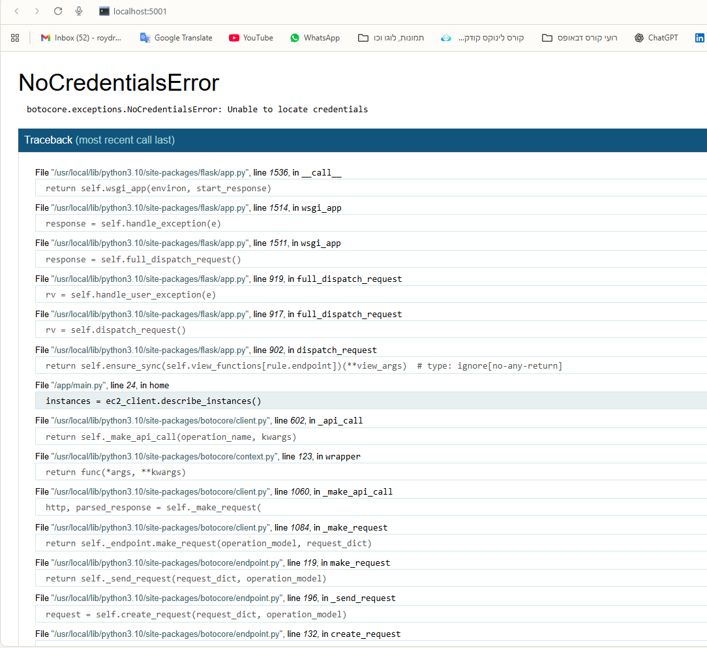

# Dockerized Flask AWS App

[](https://hub.docker.com/r/dockerdrucker/flask-aws-app)
[](https://python.org)
[](https://flask.palletsprojects.com/)

This project demonstrates how to containerize a Python-based Flask application using Docker. The app runs in a Docker container and listens on port **5001**.

## 📦 Features

- Dockerized Python Flask application
- Published on DockerHub for easy deployment
- Simple containerization demonstration
- Runs on port 5001

---

## 🔧 Prerequisites

Before running this application, make sure you have:

- [Docker Desktop](https://www.docker.com/products/docker-desktop/) installed
- Docker account (for pulling from DockerHub)

---

## 🚀 Quick Start

### Option 1: Run from DockerHub (Recommended)

The easiest way to run this application:

```bash
# Pull and run the image from DockerHub
docker run -p 5001:5001 dockerdrucker/flask-aws-app:latest
```

### Option 2: Build Locally

If you want to build the image yourself:

```bash
# Clone the repository
git clone <repository-url>
cd <project-directory>

# Build the Docker image
docker build -t flask-aws-app .

# Run the container
docker run -p 5001:5001 flask-aws-app
```

---

## 🐳 Docker Setup

### Dockerfile

This is the optimized Dockerfile used to build the image:

```dockerfile
FROM python:3.10-slim

WORKDIR /app

COPY . .
RUN pip install --no-cache-dir -r requirements.txt

EXPOSE 5001

CMD ["python", "main.py"]
```

### DockerHub Integration

This image is available on DockerHub:
- **Repository:** `dockerdrucker/flask-aws-app`
- **Tags:** `latest`
- **Pull command:** `docker pull dockerdrucker/flask-aws-app:latest`

---

## 📁 Project Structure

```
.
├── Dockerfile
├── main.py
├── requirements.txt
├── README.md
└── images/
    └── error-message.png
```

---

## 🔨 Development Workflow

### Building and Pushing to DockerHub

```bash
# Build the image
docker build -t dockerdrucker/flask-aws-app:latest .

# Login to DockerHub
docker login

# Push to DockerHub
docker push dockerdrucker/flask-aws-app:latest
```

### Local Development

```bash
# Build locally
docker build -t flask-aws-app .

# Run with live reload (mount current directory)
docker run -p 5001:5001 -v $(pwd):/app flask-aws-app
```

---

## 🌐 Access the Application

Once the container is running, visit:
- **Local:** [http://localhost:5001](http://localhost:5001)
- **Network:** `http://<your-ip>:5001`

---

## 🛠️ Troubleshooting

### Common Issues

1. **Port already in use:**
   ```bash
   docker run -p 5002:5001 dockerdrucker/flask-aws-app:latest
   ```

2. **Check running containers:**
   ```bash
   docker ps
   ```

3. **Stop a container:**
   ```bash
   docker stop <container-id>
   ```

4. **View container logs:**
   ```bash
   docker logs <container-id>
   ```

---

## 🎯 Expected Output

When you run the application, it will demonstrate Docker containerization. The app will show an error message since AWS credentials are not configured in this demo:



**This is expected behavior** - the purpose of this project is to demonstrate Docker containerization, not AWS connectivity.